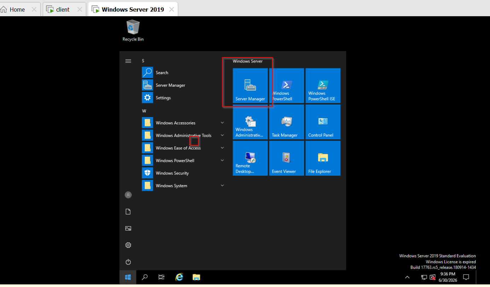
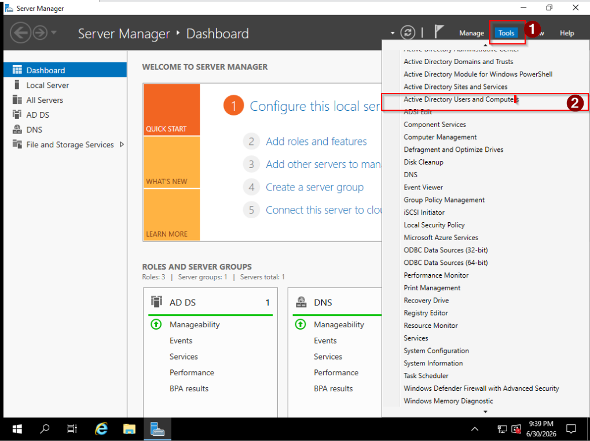
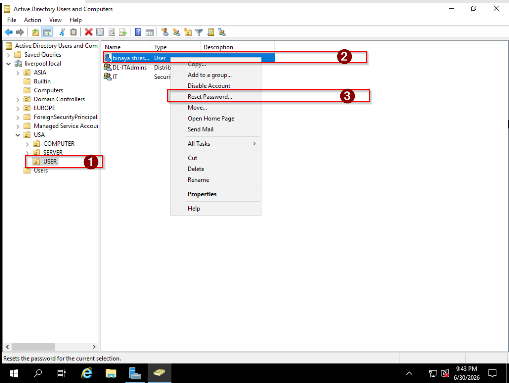
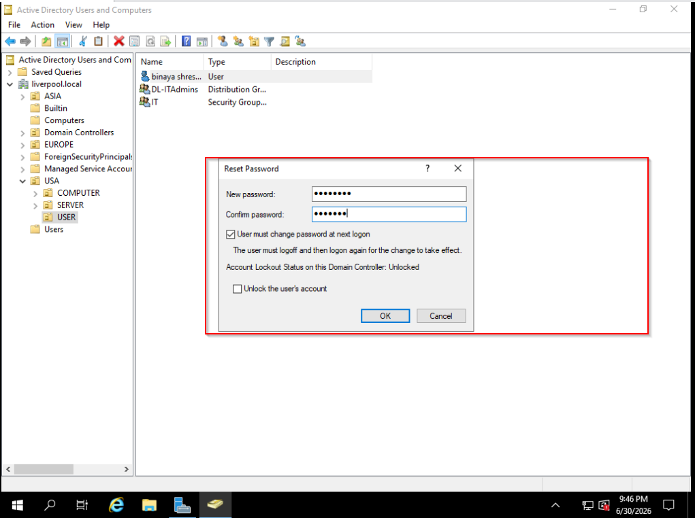
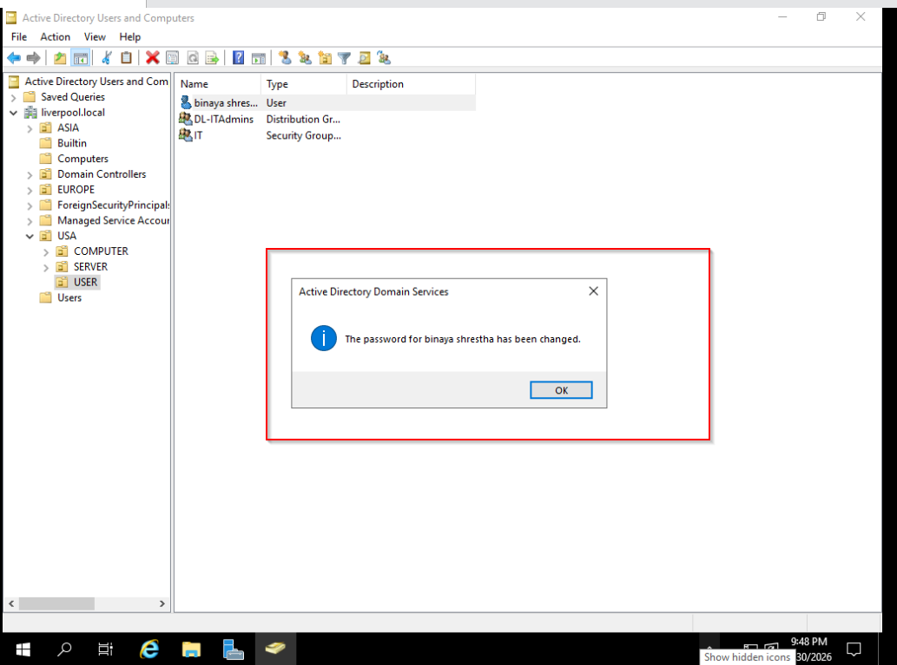
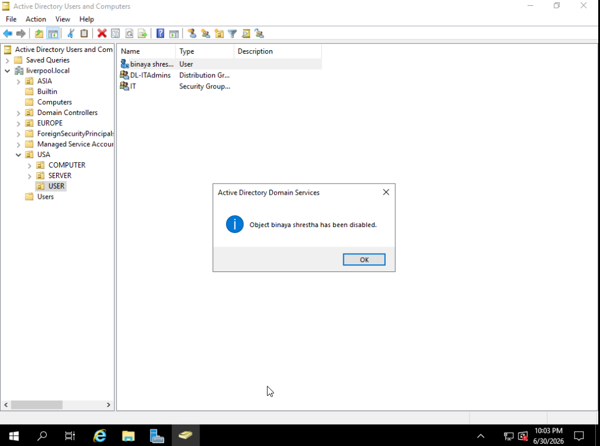

# Active Directory User Account Management — Password Reset & Offboarding

## Description

This project documents two everyday Active Directory administration tasks performed on a home lab domain controller: resetting a user's password and disabling a user account as part of an offboarding process. The lab runs on a Windows Server 2019 domain controller (VMware), managed through Active Directory Users and Computers (ADUC). The aim was to simulate the kind of account lifecycle tickets a service desk or IT support technician handles day to day — a user locked out needing a reset, and a user leaving the company needing their access revoked.

## Software used

- VMware
- Active Directory Users and Computers (ADUC)
- Server Manager

## Environments Used

- Windows Server 2019 (Domain Controller)
- Windows 10 (domain-joined client)

## Process Walkthrough

To reset a user's password, I started from Server Manager and opened the Tools menu to get to Active Directory Users and Computers:

From there I selected Active Directory Users and Computers to bring up the console showing the domain structure:

I navigated to the correct Organisational Unit, right-clicked the target user, and selected Reset Password:

I entered and confirmed a new password, and ticked "User must change password at next logon" so the temporary password I set wouldn't remain in place long-term — the user would be forced to set their own on first login:

Clicking OK confirmed the reset had gone through successfully:

To verify the reset actually worked end to end, I logged in as the user with the new password. As expected, Windows prompted that the password had to be changed before sign-in could continue:

After setting a new password at the login screen, Windows confirmed the change was successful, completing the reset workflow:

For the second part of the lab, I simulated an offboarding scenario — a user leaving the company. Rather than deleting the account outright, I right-clicked the user in ADUC and selected Disable Account, which is the standard first step in most real offboarding processes:

To confirm the account was properly locked out, I attempted to log in as that user and was met with a clear message that the account had been disabled:

## Final Thoughts

This was a good exercise in the two account actions I'll probably handle most often on a service desk: password resets and offboarding. The main thing that stood out was *why* disabling is preferred over deleting when someone leaves — disabling blocks access immediately while keeping the account, group memberships, and permissions intact in case HR needs to review files, hand over a mailbox, or check an audit trail. Deletion is usually a separate step taken later, once everything tied to the account has been reassigned, so I made sure to reflect that order in this lab rather than jumping straight to deletion.

I also made a point of forcing a password change at next logon rather than leaving my own temporary password in place — a small thing, but it's the kind of default good practice that avoids an admin-known password lingering on an account longer than it needs to.

